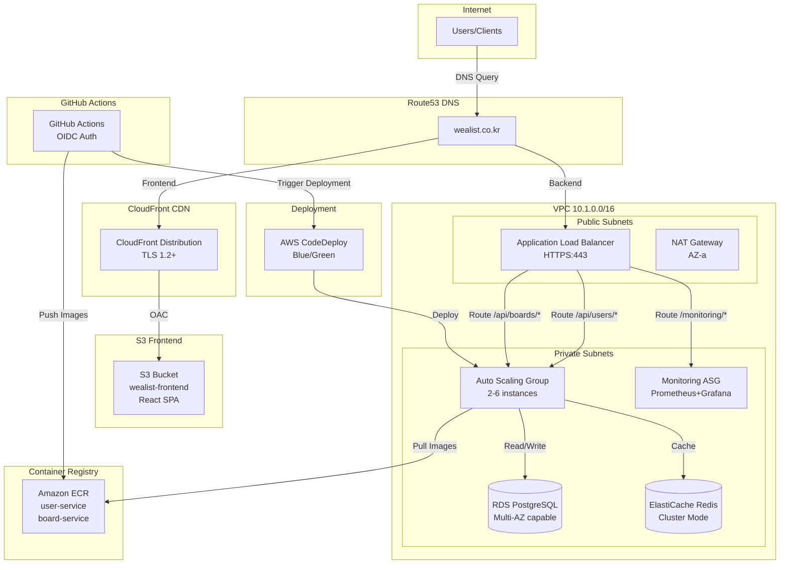
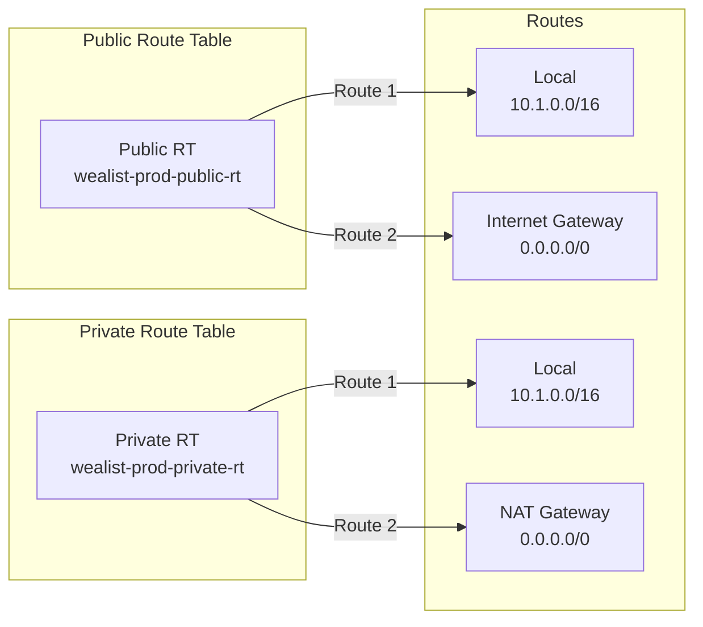
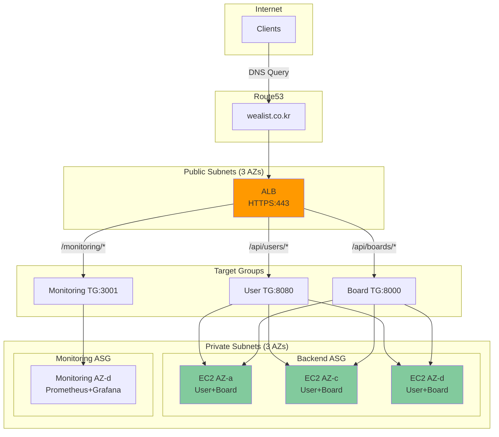
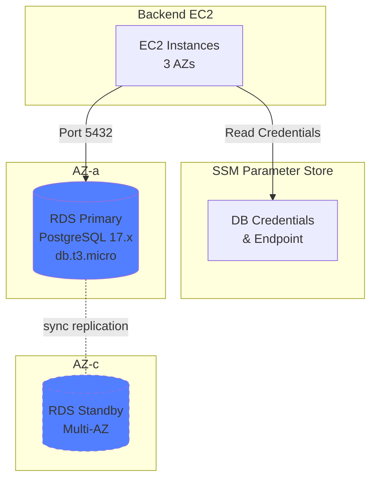
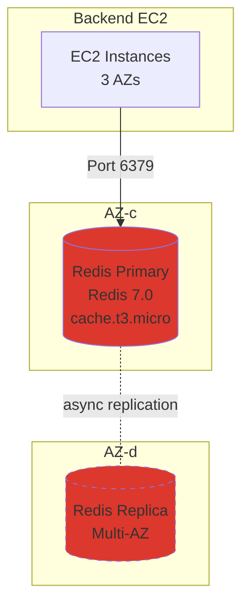
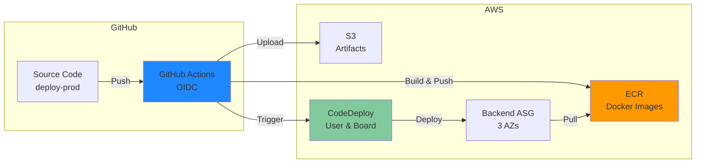
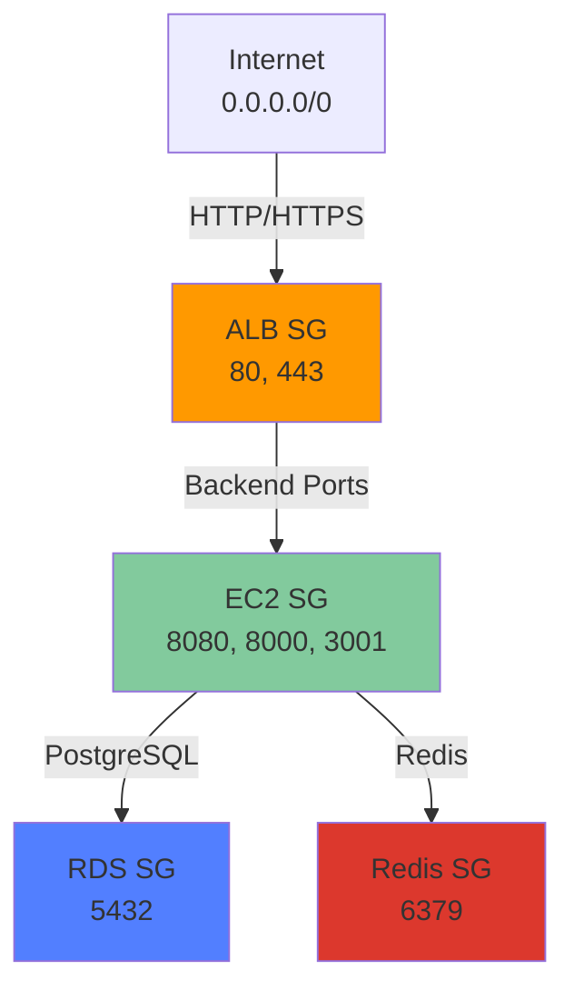
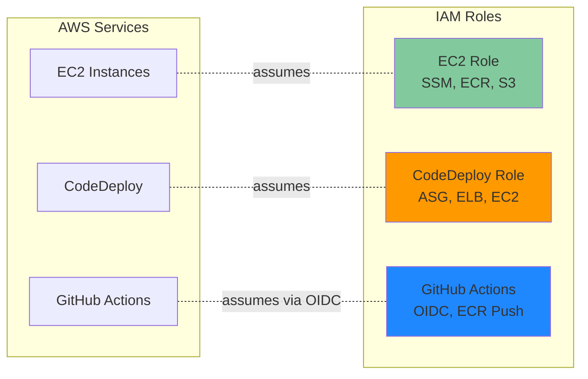

# Wealist Infrastructure Architecture

이 문서는 Wealist AWS 인프라의 상세한 아키텍처를 다이어그램으로 설명합니다.

## 목차

- [1. 전체 인프라 개요](#1-전체-인프라-개요)
- [2. VPC 및 네트워크 구조](#2-vpc-및-네트워크-구조)
- [3. Frontend (S3 + CloudFront + Route53)](#3-frontend-s3--cloudfront--route53)
- [4. Backend (EC2 + ALB + ASG)](#4-backend-ec2--alb--asg)
- [5. Database (RDS PostgreSQL)](#5-database-rds-postgresql)
- [6. Cache (ElastiCache Redis)](#6-cache-elasticache-redis)
- [7. CI/CD (CodeDeploy + ECR)](#7-cicd-codedeploy--ecr)
- [8. Security Groups 관계도](#8-security-groups-관계도)
- [9. IAM Roles 및 권한](#9-iam-roles-및-권한)

---

## 1. 전체 인프라 개요



---

## 2. VPC 및 네트워크 구조

### 2.1 VPC 전체 구조

```
┌─────────────────────────────────────────────────────────────────────────────┐
│ VPC: wealist-prod-vpc (10.1.0.0/16)                                         │
│                                                                              │
│  ┌────────────────────────────────────────────────────────────────────────┐ │
│  │ Internet Gateway (wealist-prod-igw)                                    │ │
│  └────────────────────┬───────────────────────────────────────────────────┘ │
│                       │                                                      │
│  ┌────────────────────┴───────────────────────────────────────────────────┐ │
│  │ Public Subnets (3 AZs)                                                 │ │
│  │                                                                         │ │
│  │  ┌──────────────────────┐  ┌──────────────────────┐  ┌──────────────┐ │ │
│  │  │ Public Subnet 1      │  │ Public Subnet 2      │  │ Public Sub 3 │ │ │
│  │  │ 10.1.0.0/24          │  │ 10.1.1.0/24          │  │ 10.1.2.0/24  │ │ │
│  │  │ ap-northeast-2a      │  │ ap-northeast-2c      │  │ 2d           │ │ │
│  │  │                      │  │                      │  │              │ │ │
│  │  │ ┌──────────────────┐ │  │ ┌──────────────────┐ │  │              │ │ │
│  │  │ │ ALB (instance 1) │ │  │ │ ALB (instance 2) │ │  │ ALB (inst 3) │ │ │
│  │  │ └──────────────────┘ │  │ └──────────────────┘ │  │              │ │ │
│  │  │                      │  │                      │  │              │ │ │
│  │  │ ┌──────────────────┐ │  │                      │  │              │ │ │
│  │  │ │  NAT Gateway     │ │  │                      │  │              │ │ │
│  │  │ │  (Elastic IP)    │ │  │                      │  │              │ │ │
│  │  │ └──────────────────┘ │  │                      │  │              │ │ │
│  │  └──────────────────────┘  └──────────────────────┘  └──────────────┘ │ │
│  └─────────────────────────────────────────────────────────────────────────┘ │
│                                                                              │
│  ┌─────────────────────────────────────────────────────────────────────────┐ │
│  │ Private Subnets (3 AZs)                                                 │ │
│  │                                                                         │ │
│  │  ┌──────────────────────┐  ┌──────────────────────┐  ┌──────────────────┐ │ │
│  │  │ Private Subnet 1     │  │ Private Subnet 2     │  │ Private Subnet 3 │ │ │
│  │  │ 10.1.10.0/24         │  │ 10.1.11.0/24         │  │ 10.1.12.0/24     │ │ │
│  │  │ ap-northeast-2a      │  │ ap-northeast-2c      │  │ ap-northeast-2d  │ │ │
│  │  │                      │  │                      │  │                  │ │ │
│  │  │ ┌──────────────────┐ │  │ ┌──────────────────┐ │  │ ┌──────────────┐ │ │ │
│  │  │ │ Backend EC2      │ │  │ │ Backend EC2      │ │  │ │ Backend EC2  │ │ │ │
│  │  │ │ (ASG member)     │ │  │ │ (ASG member)     │ │  │ │ (ASG member) │ │ │ │
│  │  │ │ User + Board     │ │  │ │ User + Board     │ │  │ │ User + Board │ │ │ │
│  │  │ └──────────────────┘ │  │ └──────────────────┘ │  │ └──────────────┘ │ │ │
│  │  │                      │  │                      │  │                  │ │ │
│  │  │ ┌──────────────────┐ │  │ ┌──────────────────┐ │  │ ┌──────────────┐ │ │ │
│  │  │ │ RDS Primary      │ │  │ │ Redis Primary    │ │  │ │ Monitoring   │ │ │ │
│  │  │ │ PostgreSQL       │ │  │ │ (Node 1)         │ │  │ │ EC2          │ │ │ │
│  │  │ └──────────────────┘ │  │ └──────────────────┘ │  │ │ Prometheus   │ │ │ │
│  │  │                      │  │                      │  │ │ Grafana      │ │ │ │
│  │  │                      │  │ ┌──────────────────┐ │  │ └──────────────┘ │ │ │
│  │  │                      │  │ │ RDS Standby      │ │  │                  │ │ │
│  │  │                      │  │ │ (if Multi-AZ)    │ │  │ ┌──────────────┐ │ │ │
│  │  │                      │  │ └──────────────────┘ │  │ │ Redis Replica│ │ │ │
│  │  │                      │  │                      │  │ │ (Multi-AZ)   │ │ │ │
│  │  │                      │  │                      │  │ └──────────────┘ │ │ │
│  │  └──────────────────────┘  └──────────────────────┘  └──────────────────┘ │ │
│  │                                                                         │ │
│  │  Route: 0.0.0.0/0 → NAT Gateway (in Public Subnet 1)                   │ │
│  └─────────────────────────────────────────────────────────────────────────┘ │
│                                                                              │
│  ┌─────────────────────────────────────────────────────────────────────────┐ │
│  │ VPC Endpoints (Private Subnets)                                         │ │
│  │                                                                         │ │
│  │  • com.amazonaws.ap-northeast-2.ssm                                    │ │
│  │  • com.amazonaws.ap-northeast-2.ssmmessages                            │ │
│  │  • com.amazonaws.ap-northeast-2.ec2messages                            │ │
│  │  • com.amazonaws.ap-northeast-2.s3 (Gateway Endpoint)                  │ │
│  └─────────────────────────────────────────────────────────────────────────┘ │
└─────────────────────────────────────────────────────────────────────────────┘
```

### 2.2 Routing Tables



### 2.3 Network Flow

```
┌─────────────────────────────────────────────────────────────────┐
│ Outbound Internet Access from Private Subnets                   │
└─────────────────────────────────────────────────────────────────┘

EC2 (Private Subnet 10.1.10.0/24)
    │
    ├─→ AWS Services (SSM, S3)
    │       │
    │       └─→ VPC Endpoint (No NAT cost)
    │
    └─→ External Internet (Docker Hub, apt repos)
            │
            └─→ NAT Gateway (Public Subnet 10.1.0.0/24)
                    │
                    └─→ Internet Gateway
                            │
                            └─→ Internet
```

---

## 3. Frontend (S3 + CloudFront + Route53)

```mermaid
graph TB
    subgraph "User Access"
        USER[User Browser]
    end

    subgraph "Route53"
        R53[Hosted Zone<br/>wealist.co.kr<br/><br/>A Record (Alias)<br/>→ CloudFront]
    end

    subgraph "CloudFront CDN (Global Edge Locations)"
        CF[CloudFront Distribution<br/>ID: E1234567890ABC<br/><br/>Domain: wealist.co.kr<br/>SSL: ACM Certificate (us-east-1)<br/>TLS: 1.2+<br/>Caching: Managed-CachingOptimized]

        CACHE[Edge Cache<br/>TTL: Default Policy]
    end

    subgraph "Origin (ap-northeast-2)"
        S3[S3 Bucket<br/>wealist-frontend<br/><br/>Versioning: Disabled<br/>Encryption: AES-256<br/>Public Access: BLOCKED]

        OAC[Origin Access Control<br/>SigV4 Signing<br/>CloudFront Only]
    end

    subgraph "S3 Bucket Policy"
        POLICY[Allow CloudFront OAC<br/>Deny All Others]
    end

    USER -->|1. DNS Query<br/>wealist.co.kr| R53
    R53 -->|2. Returns<br/>CloudFront IP| USER
    USER -->|3. HTTPS Request| CF
    CF -->|4. Cache Hit?| CACHE
    CACHE -->|5. Cache Miss| CF
    CF -->|6. Fetch Origin<br/>with OAC credentials| OAC
    OAC -->|7. SigV4 Request| S3
    S3 -->|8. Validate Policy| POLICY
    S3 -->|9. Return Object| CF
    CF -->|10. Cache & Return| USER

    style S3 fill:#ff9900
    style CF fill:#8b5cf6
    style R53 fill:#00a4e4
```

### Frontend Error Handling

```
CloudFront Custom Error Responses:

HTTP 403 (Forbidden)
    ↓
    Response Page: /index.html
    Response Code: 200
    Purpose: SPA routing (React Router)

HTTP 404 (Not Found)
    ↓
    Response Page: /index.html
    Response Code: 200
    Purpose: SPA routing (React Router)
```

---

## 4. Backend (EC2 + ALB + ASG)



### EC2 Instance 내부 구조

```
┌─────────────────────────────────────────────────────────────┐
│ EC2 Instance (Amazon Linux 2)                               │
│                                                              │
│  ┌────────────────────────────────────────────────────────┐ │
│  │ User Data Script (bootstrap)                           │ │
│  │  1. Install Docker + Docker Compose V2                 │ │
│  │  2. Install CodeDeploy Agent                           │ │
│  │  3. Setup ECR login helper                             │ │
│  │  4. Create temporary nginx health check servers        │ │
│  │     - Port 8080 (User Service)                         │ │
│  │     - Port 8000 (Board Service)                        │ │
│  └────────────────────────────────────────────────────────┘ │
│                                                              │
│  ┌────────────────────────────────────────────────────────┐ │
│  │ Docker Containers                                      │ │
│  │                                                        │ │
│  │  ┌──────────────────────────────────────────────────┐ │ │
│  │  │ User Service Container                           │ │ │
│  │  │  - Image: ECR/wealist-prod-user-service:latest  │ │ │
│  │  │  - Port: 8080                                    │ │ │
│  │  │  - Framework: Spring Boot                        │ │ │
│  │  │  - Health: /api/users/actuator/health            │ │ │
│  │  │  - Connects to: RDS (PostgreSQL), Redis          │ │ │
│  │  └──────────────────────────────────────────────────┘ │ │
│  │                                                        │ │
│  │  ┌──────────────────────────────────────────────────┐ │ │
│  │  │ Board Service Container                          │ │ │
│  │  │  - Image: ECR/wealist-prod-board-service:latest │ │ │
│  │  │  - Port: 8000                                    │ │ │
│  │  │  - Framework: Go                                 │ │ │
│  │  │  - Health: /api/boards/health                    │ │ │
│  │  │  - WebSocket: /api/boards/api/ws/*               │ │ │
│  │  │  - Connects to: RDS (PostgreSQL), Redis          │ │ │
│  │  └──────────────────────────────────────────────────┘ │ │
│  └────────────────────────────────────────────────────────┘ │
│                                                              │
│  ┌────────────────────────────────────────────────────────┐ │
│  │ Environment Variables (from SSM Parameter Store)      │ │
│  │  - DB_HOST, DB_PORT, DB_NAME, DB_USER, DB_PASSWORD    │ │
│  │  - REDIS_HOST, REDIS_PORT, REDIS_AUTH_TOKEN           │ │
│  │  - GOOGLE_CLIENT_ID, GOOGLE_CLIENT_SECRET             │ │
│  │  - JWT_SECRET                                          │ │
│  └────────────────────────────────────────────────────────┘ │
│                                                              │
│  ┌────────────────────────────────────────────────────────┐ │
│  │ CodeDeploy Agent                                       │ │
│  │  - Listens for deployment commands                     │ │
│  │  - Executes appspec.yml hooks                          │ │
│  │  - Manages application lifecycle                       │ │
│  └────────────────────────────────────────────────────────┘ │
└─────────────────────────────────────────────────────────────┘
```

---

## 5. Database (RDS PostgreSQL)



### RDS Connection Flow

```
┌──────────────────────────────────────────────────────────────────┐
│ Application Connection to RDS                                    │
└──────────────────────────────────────────────────────────────────┘

EC2 Instance Startup
    │
    ├─→ 1. Read SSM Parameters
    │       ├─ /wealist/prod/db/endpoint
    │       ├─ /wealist/prod/db/user_db_name
    │       ├─ /wealist/prod/db/user_db_password
    │       └─ (using IAM role with KMS decrypt permission)
    │
    ├─→ 2. Export as Environment Variables
    │       └─ Docker Compose reads these variables
    │
    └─→ 3. Application Connects
            │
            ├─→ User Service → wealist_user_db
            │       Host: wealist-prod-rds.xxxxx.ap-northeast-2.rds.amazonaws.com
            │       Port: 5432
            │       User: user_service
            │       Password: (from SSM)
            │
            └─→ Board Service → wealist_board_db
                    Host: (same RDS endpoint)
                    Port: 5432
                    User: board_service
                    Password: (from SSM)
```

### Multi-AZ Configuration

```
┌─────────────────────────────────────────────────────────────────┐
│ Single-AZ Mode (enable_multi_az = false)                        │
└─────────────────────────────────────────────────────────────────┘

┌─────────────────────┐
│ Private Subnet 1    │
│ (AZ-a)              │
│                     │
│ ┌─────────────────┐ │
│ │ RDS Primary     │ │◀─── Single instance
│ │ Read/Write      │ │     Lower cost
│ └─────────────────┘ │     ~$15/month
└─────────────────────┘

┌─────────────────────────────────────────────────────────────────┐
│ Multi-AZ Mode (enable_multi_az = true)                          │
└─────────────────────────────────────────────────────────────────┘

┌─────────────────────┐          ┌─────────────────────┐
│ Private Subnet 1    │          │ Private Subnet 2    │
│ (AZ-a)              │          │ (AZ-c)              │
│                     │          │                     │
│ ┌─────────────────┐ │          │ ┌─────────────────┐ │
│ │ RDS Primary     │ │          │ │ RDS Standby     │ │
│ │ Read/Write      │ │◀────────▶│ │ (Replica)       │ │
│ └─────────────────┘ │ Sync     │ └─────────────────┘ │
└─────────────────────┘ Repl     └─────────────────────┘
                                           │
                                           ▼
                                  Automatic Failover
                                  (60-120 seconds)
                                  Higher cost (~$30/month)
```

---

## 6. Cache (ElastiCache Redis)



### Redis Connection & Failover

```
┌──────────────────────────────────────────────────────────────────┐
│ Single-Node Mode (enable_multi_az = false)                      │
└──────────────────────────────────────────────────────────────────┘

EC2 Application
    │
    └─→ Redis Primary (10.1.11.x:6379)
            - Read/Write operations
            - No automatic failover
            - Lower cost (~$12/month)
            - Downtime during maintenance

┌──────────────────────────────────────────────────────────────────┐
│ Cluster Mode (enable_multi_az = true)                           │
└──────────────────────────────────────────────────────────────────┘

EC2 Application
    │
    ├─→ Redis Primary (10.1.11.x:6379)
    │       │
    │       ├─→ Write operations
    │       └─→ Read operations
    │
    │   Asynchronous Replication
    │       │
    │       ▼
    └─→ Redis Replica (10.1.10.x:6379)
            │
            ├─→ Read operations (optional)
            └─→ Automatic Failover
                    │
                    └─→ Promoted to Primary if Primary fails
                        (~30 seconds failover time)
```

### Redis Usage Patterns

```
┌─────────────────────────────────────────────────────────────┐
│ Application Uses Redis For:                                 │
├─────────────────────────────────────────────────────────────┤
│                                                             │
│ 1. Session Management                                       │
│    Key: session:{user_id}                                   │
│    TTL: 7 days                                              │
│    Value: {user_info, permissions, preferences}            │
│                                                             │
│ 2. Cache Layer                                              │
│    Key: cache:boards:{board_id}                            │
│    TTL: 5 minutes                                           │
│    Value: {board data from PostgreSQL}                     │
│                                                             │
│ 3. Rate Limiting                                            │
│    Key: ratelimit:{ip_address}:{endpoint}                  │
│    TTL: 1 minute                                            │
│    Value: request_count                                     │
│                                                             │
│ 4. WebSocket Connection Tracking                            │
│    Key: ws:connections:{room_id}                           │
│    TTL: No expiry (manual cleanup)                         │
│    Value: Set of {connection_ids}                          │
│                                                             │
└─────────────────────────────────────────────────────────────┘
```

---

## 7. CI/CD (CodeDeploy + ECR)



### CodeDeploy Deployment Flow

```
┌──────────────────────────────────────────────────────────────────────────┐
│ CodeDeploy Deployment Lifecycle (appspec.yml hooks)                     │
└──────────────────────────────────────────────────────────────────────────┘

1. ApplicationStop (Optional)
   └─→ Stop current application containers
       └─→ docker compose down

2. DownloadBundle
   └─→ CodeDeploy Agent downloads deployment.zip from S3
       └─→ /opt/codedeploy-agent/deployment-root/...

3. BeforeInstall
   └─→ scripts/before_install.sh
       ├─→ Backup current deployment (optional)
       ├─→ Clean old deployment files
       └─→ Prepare environment

4. Install (Automatic)
   └─→ Copy files from deployment package
       └─→ Source: / → Destination: /home/ec2-user/app/

5. AfterInstall
   └─→ scripts/after_install.sh
       ├─→ Set file permissions
       ├─→ Update environment variables
       └─→ Login to ECR

6. ApplicationStart
   └─→ scripts/application_start.sh
       ├─→ aws ecr get-login-password | docker login
       ├─→ docker compose pull (latest images from ECR)
       └─→ docker compose up -d

7. ValidateService
   └─→ scripts/validate_service.sh
       ├─→ Wait for services to start (30s)
       ├─→ curl http://localhost:8080/api/users/actuator/health
       ├─→ curl http://localhost:8000/api/boards/health
       └─→ Exit 0 if healthy, Exit 1 if failed
           └─→ Automatic Rollback on failure

8. Target Group Traffic Control (Automatic)
   └─→ CodeDeploy manages ALB Target Group registration
       ├─→ BlockTraffic: Deregister instance (30s drain)
       ├─→ Deployment happens
       └─→ AllowTraffic: Register instance back
```

### CodeDeploy Deployment Strategies

```
┌──────────────────────────────────────────────────────────────┐
│ Deployment Configuration: CodeDeployDefault.OneAtATime       │
└──────────────────────────────────────────────────────────────┘

ASG with 2 instances:

Time T0: Both instances serving traffic
┌─────────────┐  ┌─────────────┐
│ Instance 1  │  │ Instance 2  │
│ (Healthy)   │  │ (Healthy)   │
│ Version: v1 │  │ Version: v1 │
└─────────────┘  └─────────────┘
      ▲                ▲
      │                │
  ┌───┴────────────────┴───┐
  │   ALB (100% traffic)   │
  └────────────────────────┘

Time T1: Deploy to Instance 1
┌─────────────┐  ┌─────────────┐
│ Instance 1  │  │ Instance 2  │
│ (Deploying) │  │ (Healthy)   │
│ Version: v2 │  │ Version: v1 │
└─────────────┘  └─────────────┘
                       ▲
                       │
                ┌──────┴──────┐
                │ ALB (100%)  │
                └─────────────┘

Time T2: Instance 1 healthy, deploy to Instance 2
┌─────────────┐  ┌─────────────┐
│ Instance 1  │  │ Instance 2  │
│ (Healthy)   │  │ (Deploying) │
│ Version: v2 │  │ Version: v2 │
└─────────────┘  └─────────────┘
      ▲
      │
  ┌───┴──────┐
  │ ALB (100%)│
  └──────────┘

Time T3: Deployment complete
┌─────────────┐  ┌─────────────┐
│ Instance 1  │  │ Instance 2  │
│ (Healthy)   │  │ (Healthy)   │
│ Version: v2 │  │ Version: v2 │
└─────────────┘  └─────────────┘
      ▲                ▲
      │                │
  ┌───┴────────────────┴───┐
  │   ALB (100% traffic)   │
  └────────────────────────┘
```

---

## 8. Security Groups 관계도



### Security Group Traffic Flow

```
┌────────────────────────────────────────────────────────────────┐
│ Complete Traffic Flow Through Security Groups                 │
└────────────────────────────────────────────────────────────────┘

Internet (Client)
    │
    │ HTTPS (443)
    ▼
┌───────────────────────┐
│ ALB Security Group    │
│ Allow: 80, 443 ← Any  │
└───────┬───────────────┘
        │ Forward to backend
        │ Ports: 8080, 8000, 3001
        ▼
┌───────────────────────────┐
│ EC2 Security Group        │
│ Allow: 8080 ← ALB SG      │
│ Allow: 8000 ← ALB SG      │
│ Allow: 3001 ← ALB SG      │
└───┬───────────┬───────┬───┘
    │           │       │
    │           │       └─────────────────┐
    │           │                         │
    │ 5432      │ 6379                    │ 443
    ▼           ▼                         ▼
┌─────────┐ ┌─────────┐         ┌──────────────────┐
│ RDS SG  │ │Redis SG │         │ VPC Endpoints SG │
│ Allow:  │ │ Allow:  │         │ Allow:           │
│ 5432    │ │ 6379    │         │ 443 ← VPC CIDR   │
│ ← EC2   │ │ ← EC2   │         │                  │
└─────────┘ └─────────┘         └──────────────────┘
     │          │                        │
     ▼          ▼                        ▼
   [RDS]     [Redis]              [SSM, S3 Endpoints]
```

---

## 9. IAM Roles 및 권한



### IAM Policy Details

```
┌──────────────────────────────────────────────────────────────────┐
│ EC2 Instance Role: wealist-prod-ec2-role                         │
└──────────────────────────────────────────────────────────────────┘

1. SSM + KMS Policy (wealist-prod-ssm-kms-policy):
   {
     "Effect": "Allow",
     "Action": [
       "ssm:GetParameter",
       "ssm:GetParameters",
       "ssm:GetParametersByPath"
     ],
     "Resource": "arn:aws:ssm:ap-northeast-2:*:parameter/wealist/*"
   },
   {
     "Effect": "Allow",
     "Action": ["kms:Decrypt"],
     "Resource": "*"
   }

2. ECR Policy (wealist-prod-ecr-policy):
   {
     "Effect": "Allow",
     "Action": ["ecr:GetAuthorizationToken"],
     "Resource": "*"
   },
   {
     "Effect": "Allow",
     "Action": [
       "ecr:BatchCheckLayerAvailability",
       "ecr:GetDownloadUrlForLayer",
       "ecr:BatchGetImage"
     ],
     "Resource": "arn:aws:ecr:*:*:repository/wealist-prod-*"
   }

3. S3 Policy (wealist-prod-s3-policy):
   {
     "Effect": "Allow",
     "Action": ["s3:ListBucket"],
     "Resource": [
       "arn:aws:s3:::wealist-deploy-scripts",
       "arn:aws:s3:::wealist-app-resources"
     ]
   },
   {
     "Effect": "Allow",
     "Action": ["s3:GetObject"],
     "Resource": "arn:aws:s3:::wealist-deploy-scripts/*"
   },
   {
     "Effect": "Allow",
     "Action": ["s3:GetObject", "s3:PutObject", "s3:DeleteObject"],
     "Resource": "arn:aws:s3:::wealist-app-resources/*"
   }

┌──────────────────────────────────────────────────────────────────┐
│ GitHub Actions OIDC Role: wealist-prod-github-actions-role       │
└──────────────────────────────────────────────────────────────────┘

Trust Policy:
{
  "Version": "2012-10-17",
  "Statement": [
    {
      "Effect": "Allow",
      "Principal": {
        "Federated": "arn:aws:iam::290008131187:oidc-provider/token.actions.githubusercontent.com"
      },
      "Action": "sts:AssumeRoleWithWebIdentity",
      "Condition": {
        "StringLike": {
          "token.actions.githubusercontent.com:sub": [
            "repo:OrangesCloud/*",
            "repo:orangescloud/*"
          ]
        }
      }
    }
  ]
}

Permissions Policy (wealist-prod-github-actions-policy):
{
  "Effect": "Allow",
  "Action": [
    "ssm:GetParameter",
    "ssm:PutParameter",
    "ssm:SendCommand",
    "ecr:GetAuthorizationToken",
    "ecr:*",
    "s3:PutObject",
    "s3:GetObject",
    "s3:DeleteObject",
    "codedeploy:CreateDeployment",
    "codedeploy:GetDeployment",
    "codedeploy:RegisterApplicationRevision",
    "ec2:DescribeInstances",
    "autoscaling:DescribeAutoScalingGroups",
    "cloudfront:CreateInvalidation"
  ],
  "Resource": [
    "arn:aws:ssm:*:*:parameter/wealist/prod/*",
    "arn:aws:ecr:*:*:repository/wealist-prod-*",
    "arn:aws:s3:::wealist-codedeploy-artifacts/*",
    "arn:aws:s3:::wealist-app-artifacts/*",
    "arn:aws:codedeploy:*:*:application/wealist-*",
    "*"
  ]
}
```

---

## 요약

이 문서는 Wealist 인프라의 다음 구성요소를 상세히 다룹니다:

1. **전체 아키텍처**: 3-Tier 구조 및 컴포넌트 간 연결
2. **VPC 네트워크**: Public/Private 서브넷, NAT Gateway, VPC Endpoints
3. **Frontend**: S3 + CloudFront + Route53 + OAC
4. **Backend**: EC2 + ASG + ALB + Target Groups
5. **Database**: RDS PostgreSQL (수동 관리) + Multi-AZ 옵션
6. **Cache**: ElastiCache Redis Cluster
7. **CI/CD**: GitHub Actions OIDC + CodeDeploy + ECR
8. **Security Groups**: 5개 SG 간의 트래픽 흐름
9. **IAM Roles**: EC2, CodeDeploy, GitHub Actions 역할 및 권한

각 섹션은 ASCII 다이어그램과 Mermaid 차트로 시각화되어 있습니다.
